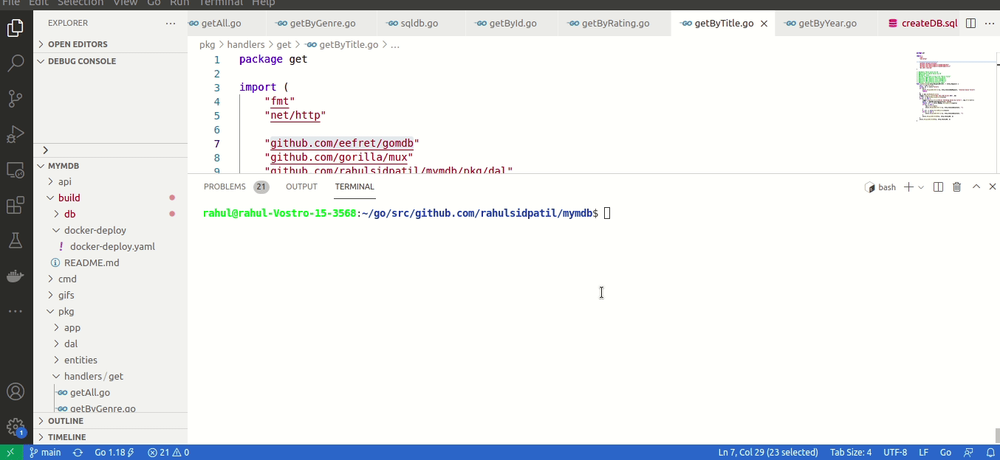

# My Movies Database(mymdb):
The application is a simple REST API server that will provide endpoints to allow consumers to access movies data.

# Getting started
Following are the steps to run this application in local docker environment

## How to Contribute
# Prerequisites
- git (recommended version version 2.25.1 or higher)
- Go (recommended version version go1.18 or higher)
- docker (recommended version 20.10.11 or higher). 
Installation steps available at: https://docs.docker.com/engine/install/ubuntu/ https://docs.docker.com/engine/install/linux-postinstall/
Make sure to be able to run `docker as non root user` 
- docker-compose version (recommended version 1.26.2 or higher)
Installation steps available at: https://docs.docker.com/compose/install/ https://docs.docker.com/engine/security/rootless/
Make sure to be able to run `docker-compose as non root user`

## Building, Running and Accessing the application:
1) Clone the mymdb repository to your $(GOPATH) e.g. `~/go/src/github.com/rahulsidpatil`
```
git clone git@github.com:rahulsidpatil/mymdb.git
```
2) cd to mymdb dir
```
cd mymdb
```
3) To build and run mymdb; use follwoing command
```
make docker-deploy-up
```
It will a take a while to build and deploy the application on your local docker environment.
Once the deployment is successful; the console will display application access urls as:
```
echo "Server started at url: http://localhost:8080"
Server started at url: http://localhost:8080
echo "The API documentation is available at url: http://localhost:8080/swagger/"
The API documentation is available at url: http://localhost:8080/swagger/
```
4) To stop mymdb; use following command:
```
make docker-deploy-down
```

## mymdb in action:
1) Build and deploy mymdb:


2) Use mymdb:


## Postman collection
The Postman collection for all the API endpoints is available at: 
`github.com/rahulsidpatil/mymdb/postman_collection/mymdb-endpoints.postman_collection.json`

All you need to do is - 'Import it in Postman client and run collection'

# Overview of code structure:
```
.
├── api
│   └── docs
│       ├── docs.go
│       ├── swagger.json
│       └── swagger.yaml
├── build
│   ├── db
│   │   └── mysql
│   │       ├── Dockerfile
│   │       └── scripts
│   │           └── createDB.sql
│   ├── docker-deploy
│   │   └── docker-deploy.yaml
│   └── README.md
├── cmd
│   ├── main.go
│   └── README.md
├── Dockerfile
├── gifs
│   ├── mymdb-build-n-deploy.gif
│   └── mymdb-try-it-out.gif
├── go.mod
├── go.sum
├── Makefile
├── pkg
│   ├── app
│   │   └── app.go
│   ├── dal
│   │   └── sqldb.go
│   ├── entities
│   │   └── movie.go
│   ├── handlers
│   │   └── get
│   │       ├── getAll.go
│   │       ├── getByGenre.go
│   │       ├── getById.go
│   │       ├── getByRating.go
│   │       ├── getByTitle.go
│   │       └── getByYear.go
│   ├── logging
│   │   └── logger.go
│   └── utils
│       ├── httpErrorUtil.go
│       └── utils.go
├── postman_collection
│   └── mymdb-endpoints.postman_collection.json
└── README.md
```

## Note:
All The Happy path scenarios are in working state. Minimum Viable Functionality is in place.
Following areas are still Work In Progress(WIP):
1. TODO: Do away with mysql raw queries
2. TODO: Add unit tests for functions
3. WIP: Dynamically update local movie database at runtime (by fetching movie data from `gomdb`)
4. WIP: Code optimization/sanitization
5. WIP: Add more documentation